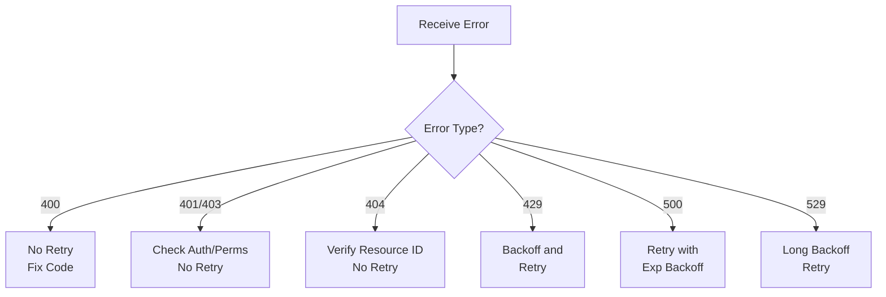

# Claude API Error Handling and Retry Strategies

Building robust and reliable API integrations requires understanding how to properly handle errors and implement effective retry strategies. This comprehensive guide covers error types that can occur with the Claude API, how to handle them appropriately, and best practices for production environments.

## HTTP Status Codes and Error Responses

Understanding the HTTP status codes returned by the Claude API and how to respond to each is fundamental to robust error handling.

### HTTP Status Codes Reference

| Status Code | Name | Description | Response |
|---|---|---|---|
| 400 | Bad Request | Invalid request parameters | Validate and fix the request |
| 401 | Unauthorized | Missing or invalid API key | Check API key configuration |
| 403 | Forbidden | Request operation not permitted | Verify account permissions |
| 404 | Not Found | Requested resource doesn't exist | Check endpoint or model ID |
| 429 | Too Many Requests | Rate limit exceeded | Implement backoff and retry |
| 500 | Internal Server Error | Server-side error occurred | Retry with exponential backoff |
| 529 | Service Unavailable | Server is overloaded | Retry with longer backoff |

### Standard Error Response Format

All error responses from the Claude API follow a standardized JSON format:

```json
{
  "type": "error",
  "error": {
    "type": "error_type_here",
    "message": "Error message describing what went wrong"
  }
}
```

Example error response:

```json
{
  "type": "error",
  "error": {
    "type": "invalid_request_error",
    "message": "max_tokens must be between 1 and 4096"
  }
}
```

## Error Types and Handling Strategies

### Error Type Reference

| Error Type | HTTP Status | Description | Recommended Action |
|---|---|---|---|
| `invalid_request_error` | 400 | Invalid request parameters | Fix code, do not retry |
| `authentication_error` | 401 | Authentication failed | Verify API key |
| `permission_error` | 403 | Operation not permitted | Check account permissions |
| `not_found_error` | 404 | Resource not found | Verify resource ID |
| `rate_limit_error` | 429 | Rate limit exceeded | Backoff and retry |
| `api_error` | 500 | Server internal error | Retry with backoff |
| `overloaded_error` | 529 | Server overloaded | Retry with longer backoff |

### Error Handling Decision Flow



> **Critical Note**: Errors 400, 401, 403, and 404 indicate code issues and won't succeed on retry. Always fix the code before retrying.

## Understanding Rate Limiting

The Claude API implements rate limiting to prevent excessive requests and ensure fair resource allocation.

### Rate Limit Parameters

- **RPM (Requests Per Minute)**: Maximum number of requests allowed per minute
- **TPM (Tokens Per Minute)**: Maximum number of tokens processed per minute

When rate limits are exceeded, the API returns HTTP 429 with a `rate_limit_error`.

Response headers contain rate limit information:

```
RateLimit-Limit-Requests: 50
RateLimit-Limit-Tokens: 90000
RateLimit-Remaining-Requests: 10
RateLimit-Remaining-Tokens: 45000
RateLimit-Reset-Requests: 2026-03-08T12:34:56Z
RateLimit-Reset-Tokens: 2026-03-08T12:34:56Z
```

Monitoring these headers helps you plan retries more effectively and avoid hitting rate limits.

## Implementing Retry Strategies

### Exponential Backoff Fundamentals

Retries should never be unlimited. Exponential backoff reduces server load while improving your chances of success:

```
wait_time = min(base_delay * (2 ^ retry_count), max_delay) + jitter
```

The `jitter` (random component) prevents thundering herd problems where many clients retry simultaneously.

### Python Implementation

Here's how to implement exponential backoff in Python:

```python
import time
import random
from typing import TypeVar, Callable, Any
import anthropic

T = TypeVar('T')

def retry_with_exponential_backoff(
    func: Callable[..., T],
    max_retries: int = 3,
    base_delay: float = 1.0,
    max_delay: float = 60.0,
) -> T:
    """
    Execute a function with exponential backoff retry logic.

    Args:
        func: Function to execute
        max_retries: Maximum number of retry attempts
        base_delay: Initial delay in seconds
        max_delay: Maximum delay in seconds

    Returns:
        The function's return value

    Raises:
        Exception: If maximum retries exceeded
    """
    for attempt in range(max_retries + 1):
        try:
            return func()
        except anthropic.RateLimitError:
            if attempt == max_retries:
                raise

            # Exponential backoff with jitter
            delay = min(base_delay * (2 ** attempt), max_delay)
            jitter = random.uniform(0, delay * 0.1)
            wait_time = delay + jitter

            print(f"Rate limited. Retrying in {wait_time:.2f} seconds...")
            time.sleep(wait_time)
        except anthropic.APIStatusError as e:
            if e.status_code == 500 or e.status_code == 529:
                if attempt == max_retries:
                    raise

                delay = min(base_delay * (2 ** attempt), max_delay)
                jitter = random.uniform(0, delay * 0.1)
                wait_time = delay + jitter

                print(f"Server error ({e.status_code}). Retrying in {wait_time:.2f} seconds...")
                time.sleep(wait_time)
            else:
                # Non-retryable error
                raise

# Usage example
def call_api():
    client = anthropic.Anthropic()
    return client.messages.create(
        model="claude-3-5-sonnet-20241022",
        max_tokens=1024,
        messages=[
            {"role": "user", "content": "Hello, Claude!"}
        ]
    )

response = retry_with_exponential_backoff(call_api)
print(response)
```

### TypeScript Implementation

Here's the equivalent implementation in TypeScript:

```typescript
import Anthropic from "@anthropic-ai/sdk";

interface RetryOptions {
  maxRetries?: number;
  baseDelay?: number;
  maxDelay?: number;
}

async function retryWithExponentialBackoff<T>(
  fn: () => Promise<T>,
  options: RetryOptions = {}
): Promise<T> {
  const {
    maxRetries = 3,
    baseDelay = 1000, // milliseconds
    maxDelay = 60000,
  } = options;

  for (let attempt = 0; attempt <= maxRetries; attempt++) {
    try {
      return await fn();
    } catch (error) {
      if (attempt === maxRetries) {
        throw error;
      }

      const isRetryableError =
        (error instanceof Anthropic.RateLimitError) ||
        (error instanceof Anthropic.APIStatusError &&
          (error.status === 500 || error.status === 529));

      if (!isRetryableError) {
        throw error;
      }

      const delay = Math.min(
        baseDelay * Math.pow(2, attempt),
        maxDelay
      );
      const jitter = Math.random() * delay * 0.1;
      const waitTime = delay + jitter;

      console.log(
        `Retryable error encountered. Waiting ${waitTime.toFixed(2)}ms before retry...`
      );
      await new Promise((resolve) => setTimeout(resolve, waitTime));
    }
  }
}

// Usage example
async function main() {
  const client = new Anthropic();

  const message = await retryWithExponentialBackoff(async () => {
    return client.messages.create({
      model: "claude-3-5-sonnet-20241022",
      max_tokens: 1024,
      messages: [
        {
          role: "user",
          content: "Hello, Claude!",
        },
      ],
    });
  });

  console.log(message.content);
}

main().catch(console.error);
```

## SDK Built-in Retry Behavior

The Anthropic Python and TypeScript SDKs include automatic retry functionality out of the box.

### Python SDK

The Python SDK automatically retries in these scenarios:

- HTTP 429 (Rate Limit Error)
- HTTP 500 (Internal Server Error)
- HTTP 529 (Service Unavailable)

The default maximum retry attempts is 3:

```python
import anthropic

client = anthropic.Anthropic()

# SDK handles retries automatically
message = client.messages.create(
    model="claude-3-5-sonnet-20241022",
    max_tokens=1024,
    messages=[
        {"role": "user", "content": "Hello, Claude!"}
    ]
)
```

You can customize retry behavior by passing retry configuration:

```python
from anthropic import Anthropic

client = Anthropic(
    max_retries=5,  # Maximum retry attempts
)
```

### TypeScript SDK

The TypeScript SDK provides similar automatic retry behavior:

```typescript
import Anthropic from "@anthropic-ai/sdk";

const client = new Anthropic({
  apiKey: process.env.ANTHROPIC_API_KEY,
  maxRetries: 3,  // Customize if needed
});

// SDK handles retries automatically
const message = await client.messages.create({
  model: "claude-3-5-sonnet-20241022",
  max_tokens: 1024,
  messages: [
    {
      role: "user",
      content: "Hello, Claude!",
    },
  ],
});
```

> **Tip**: While SDK auto-retry is convenient, custom retry logic is useful for complex requirements, additional context handling, or specific retry policies not covered by the SDK.

## Circuit Breaker Pattern

The circuit breaker pattern prevents cascading failures by stopping requests to a failing service. When too many errors occur, the breaker "opens" and prevents further requests temporarily.

### Python Circuit Breaker Implementation

```python
from enum import Enum
from datetime import datetime, timedelta
from typing import Callable, TypeVar

T = TypeVar('T')

class CircuitState(Enum):
    """Circuit breaker states"""
    CLOSED = "closed"          # Normal operation
    OPEN = "open"              # Failure detected, requests blocked
    HALF_OPEN = "half_open"    # Recovery test in progress

class CircuitBreaker:
    """
    Circuit breaker implementation for fault tolerance.

    Tracks consecutive failures and temporarily blocks requests
    when a threshold is exceeded.
    """
    def __init__(
        self,
        failure_threshold: int = 5,
        success_threshold: int = 2,
        timeout: int = 60,
    ):
        """
        Initialize circuit breaker.

        Args:
            failure_threshold: Failures before opening circuit
            success_threshold: Successes in half-open state to close
            timeout: Seconds before attempting recovery
        """
        self.failure_threshold = failure_threshold
        self.success_threshold = success_threshold
        self.timeout = timeout

        self.failure_count = 0
        self.success_count = 0
        self.last_failure_time = None
        self.state = CircuitState.CLOSED

    def call(self, func: Callable[..., T], *args, **kwargs) -> T:
        """
        Execute function through circuit breaker.

        Args:
            func: Function to execute
            *args: Positional arguments for func
            **kwargs: Keyword arguments for func

        Returns:
            Function result

        Raises:
            Exception: If circuit is open or function fails
        """
        if self.state == CircuitState.OPEN:
            if self._should_attempt_reset():
                self.state = CircuitState.HALF_OPEN
                self.success_count = 0
            else:
                raise Exception("Circuit breaker is OPEN. Too many failures.")

        try:
            result = func(*args, **kwargs)
            self._on_success()
            return result
        except Exception as e:
            self._on_failure()
            raise

    def _on_success(self):
        """Handle successful execution"""
        self.failure_count = 0

        if self.state == CircuitState.HALF_OPEN:
            self.success_count += 1
            if self.success_count >= self.success_threshold:
                self.state = CircuitState.CLOSED
                print("Circuit breaker closed - system recovered")

    def _on_failure(self):
        """Handle failed execution"""
        self.failure_count += 1
        self.last_failure_time = datetime.now()

        if self.failure_count >= self.failure_threshold:
            self.state = CircuitState.OPEN
            print("Circuit breaker opened - too many failures")

    def _should_attempt_reset(self) -> bool:
        """Check if recovery timeout has elapsed"""
        if self.last_failure_time is None:
            return False

        elapsed = datetime.now() - self.last_failure_time
        return elapsed >= timedelta(seconds=self.timeout)

# Usage example
import anthropic

breaker = CircuitBreaker(failure_threshold=3, timeout=30)

def call_claude_api():
    client = anthropic.Anthropic()
    return client.messages.create(
        model="claude-3-5-sonnet-20241022",
        max_tokens=1024,
        messages=[
            {"role": "user", "content": "Hello, Claude!"}
        ]
    )

try:
    response = breaker.call(call_claude_api)
    print(response)
except Exception as e:
    print(f"Error: {e}")
```

### TypeScript Circuit Breaker Implementation

```typescript
enum CircuitState {
  CLOSED = "closed",
  OPEN = "open",
  HALF_OPEN = "half_open",
}

interface CircuitBreakerOptions {
  failureThreshold?: number;
  successThreshold?: number;
  timeout?: number; // milliseconds
}

class CircuitBreaker {
  private state: CircuitState = CircuitState.CLOSED;
  private failureCount: number = 0;
  private successCount: number = 0;
  private lastFailureTime: Date | null = null;

  private failureThreshold: number;
  private successThreshold: number;
  private timeout: number;

  constructor(options: CircuitBreakerOptions = {}) {
    this.failureThreshold = options.failureThreshold ?? 5;
    this.successThreshold = options.successThreshold ?? 2;
    this.timeout = options.timeout ?? 60000;
  }

  async call<T>(fn: () => Promise<T>): Promise<T> {
    if (this.state === CircuitState.OPEN) {
      if (this.shouldAttemptReset()) {
        this.state = CircuitState.HALF_OPEN;
        this.successCount = 0;
      } else {
        throw new Error("Circuit breaker is OPEN. Too many failures.");
      }
    }

    try {
      const result = await fn();
      this.onSuccess();
      return result;
    } catch (error) {
      this.onFailure();
      throw error;
    }
  }

  private onSuccess(): void {
    this.failureCount = 0;

    if (this.state === CircuitState.HALF_OPEN) {
      this.successCount++;
      if (this.successCount >= this.successThreshold) {
        this.state = CircuitState.CLOSED;
        console.log("Circuit breaker closed - system recovered");
      }
    }
  }

  private onFailure(): void {
    this.failureCount++;
    this.lastFailureTime = new Date();

    if (this.failureCount >= this.failureThreshold) {
      this.state = CircuitState.OPEN;
      console.log("Circuit breaker opened - too many failures");
    }
  }

  private shouldAttemptReset(): boolean {
    if (!this.lastFailureTime) {
      return false;
    }

    const elapsed = Date.now() - this.lastFailureTime.getTime();
    return elapsed >= this.timeout;
  }
}

// Usage example
import Anthropic from "@anthropic-ai/sdk";

const breaker = new CircuitBreaker({
  failureThreshold: 3,
  timeout: 30000,
});

const client = new Anthropic();

async function main() {
  try {
    const response = await breaker.call(async () => {
      return client.messages.create({
        model: "claude-3-5-sonnet-20241022",
        max_tokens: 1024,
        messages: [
          {
            role: "user",
            content: "Hello, Claude!",
          },
        ],
      });
    });

    console.log(response.content);
  } catch (error) {
    console.error("Error:", error);
  }
}

main();
```

## Handling Streaming Errors

Streaming responses require different error handling approaches compared to standard requests.

### Streaming-Specific Errors

- **Connection Errors**: Network connection is lost or interrupted
- **Stream Event Errors**: Errors occur during streaming event processing
- **Timeout Errors**: Timeout waiting for stream data

### Python Streaming Error Handling

```python
import anthropic

def stream_with_error_handling():
    """
    Handle errors when streaming responses from Claude API.

    Demonstrates proper error handling for different failure modes
    in streaming contexts.
    """
    client = anthropic.Anthropic()

    try:
        with client.messages.stream(
            model="claude-3-5-sonnet-20241022",
            max_tokens=1024,
            messages=[
                {"role": "user", "content": "Write a short story"}
            ],
        ) as stream:
            # Process text from stream
            for text in stream.text_stream:
                print(text, end="", flush=True)

    except anthropic.APIConnectionError as e:
        # Handle network connection errors
        print(f"Connection error: {e}")
        # Implement reconnection logic
        # Consider using exponential backoff before reconnecting

    except anthropic.APIStatusError as e:
        # Handle API-specific errors during streaming
        if e.status_code == 429:
            print("Rate limited while streaming")
            # Implement longer backoff for rate limit errors
        elif e.status_code >= 500:
            print(f"Server error during streaming: {e.status_code}")
            # Retry with exponential backoff
        else:
            print(f"API error: {e.status_code} - {e.message}")

    except Exception as e:
        # Catch unexpected errors
        print(f"Unexpected error during streaming: {e}")

# Execute streaming with error handling
stream_with_error_handling()
```

### TypeScript Streaming Error Handling

```typescript
import Anthropic from "@anthropic-ai/sdk";

async function streamWithErrorHandling() {
  const client = new Anthropic();

  try {
    const stream = await client.messages.stream({
      model: "claude-3-5-sonnet-20241022",
      max_tokens: 1024,
      messages: [
        {
          role: "user",
          content: "Write a short story",
        },
      ],
    });

    // Process stream events
    for await (const chunk of stream) {
      if (
        chunk.type === "content_block_delta" &&
        chunk.delta.type === "text_delta"
      ) {
        process.stdout.write(chunk.delta.text);
      }
    }
  } catch (error) {
    if (error instanceof Anthropic.APIConnectionError) {
      // Handle network connection errors
      console.error("Connection error:", error.message);
      // Implement reconnection logic with backoff
    } else if (error instanceof Anthropic.APIStatusError) {
      // Handle API errors during streaming
      if (error.status === 429) {
        console.error("Rate limited while streaming");
        // Use longer backoff delays
      } else if (error.status >= 500) {
        console.error(`Server error during streaming: ${error.status}`);
        // Retry with exponential backoff
      } else {
        console.error(`API error: ${error.status} - ${error.message}`);
      }
    } else {
      // Handle unexpected errors
      console.error("Unexpected error during streaming:", error);
    }
  }
}

streamWithErrorHandling();
```

## Production Best Practices

### 1. Set Request Timeouts

Prevent requests from hanging indefinitely:

```python
import anthropic

# Set 30-second timeout for all requests
client = anthropic.Anthropic(timeout=30.0)
```

```typescript
import Anthropic from "@anthropic-ai/sdk";

const client = new Anthropic({
  timeout: 30 * 1000, // 30 seconds
});
```

### 2. Implement Comprehensive Error Logging

Log errors with full context for debugging:

```python
import logging
from datetime import datetime

logging.basicConfig(level=logging.INFO)
logger = logging.getLogger(__name__)

def log_api_error(error, attempt, context):
    """
    Log API errors with full context.

    Args:
        error: The exception that occurred
        attempt: Retry attempt number
        context: Additional context about the request
    """
    logger.error(
        "API call failed",
        extra={
            "timestamp": datetime.now().isoformat(),
            "error_type": type(error).__name__,
            "error_message": str(error),
            "attempt": attempt,
            "context": context,
        }
    )
```

### 3. Identify Retryable Errors Correctly

Not all errors should be retried:

```python
import anthropic

def is_retryable_error(error):
    """
    Determine if an error should be retried.

    Returns:
        True if error is transient and retryable, False otherwise
    """
    # Rate limit errors are always retryable
    if isinstance(error, anthropic.RateLimitError):
        return True

    # Server errors (5xx) are retryable
    if isinstance(error, anthropic.APIStatusError):
        return error.status_code in [500, 529]

    # Client errors (4xx) are not retryable
    return False
```

### 4. Request Cancellation Support

Allow long-running requests to be cancelled:

```python
import threading
import anthropic

def call_api_with_cancellation(timeout_seconds=30):
    """
    Call API with timeout and cancellation support.

    Args:
        timeout_seconds: Maximum time to wait for response

    Returns:
        API response

    Raises:
        TimeoutError: If request exceeds timeout
    """
    result = [None]
    exception = [None]

    def api_call():
        try:
            client = anthropic.Anthropic()
            result[0] = client.messages.create(
                model="claude-3-5-sonnet-20241022",
                max_tokens=1024,
                messages=[
                    {"role": "user", "content": "Hello, Claude!"}
                ]
            )
        except Exception as e:
            exception[0] = e

    # Run API call in separate thread
    thread = threading.Thread(target=api_call, daemon=True)
    thread.start()
    thread.join(timeout=timeout_seconds)

    if thread.is_alive():
        raise TimeoutError(
            f"API call exceeded {timeout_seconds}s timeout"
        )

    if exception[0]:
        raise exception[0]

    return result[0]
```

## Troubleshooting Guide

### Common Issues and Solutions

**Problem: Frequent 429 Rate Limit Errors**
- Increase backoff wait times
- Reduce request frequency
- Increase maximum retry attempts
- Batch requests when possible
- Monitor RPM and TPM headers

**Problem: Persistent 500 Errors**
- Check API status page at status.anthropic.com
- Contact support with request IDs
- Verify API key has necessary permissions
- Check for API deprecations

**Problem: Timeout Errors**
- Increase timeout values gradually
- Simplify requests (shorter prompts)
- Reduce max_tokens value
- Check network connectivity
- Verify server latency

**Problem: Streaming Disconnections**
- Implement automatic reconnection logic
- Check for client-side network issues
- Verify connection stability
- Use connection keep-alives

## Summary

Effective error handling and retry strategies are fundamental to building production-grade API integrations. By implementing the patterns and practices covered in this guide, you can create resilient systems that gracefully handle transient failures while avoiding unnecessary strain on the API infrastructure.

Key takeaways:

- Understand different error types and handle each appropriately
- Implement exponential backoff with jitter for retries
- Use circuit breakers to prevent cascading failures
- Handle streaming errors with special consideration
- Log errors comprehensively for debugging
- Monitor rate limit headers proactively
- Set appropriate timeouts for all requests
- Test error handling paths thoroughly

For more information and updates, refer to the official Claude API documentation.
