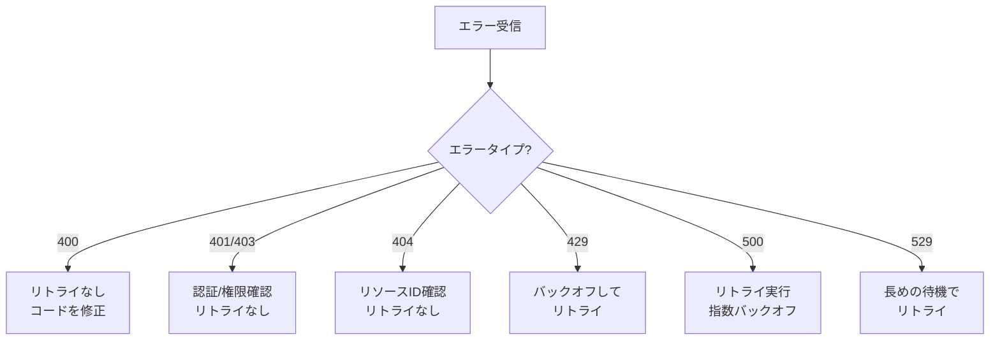

# Claude API エラーハンドリングとリトライ戦略

堅牢で信頼性の高い API 統合を構築するには、適切なエラーハンドリングとリトライ戦略が不可欠です。このガイドでは、Claude API で発生する可能性のあるエラーの種類、その対処方法、そして本番環境での最適なプラクティスについて解説します。

## HTTP ステータスコードとエラー対応

Claude API から返される HTTP ステータスコードと、それぞれの対応方法を理解することが重要です。

### HTTP ステータスコード一覧

| ステータスコード | 名称 | 説明 | 対応方法 |
|---|---|---|---|
| 400 | Bad Request | リクエストパラメータが無効 | リクエストの内容を確認し修正 |
| 401 | Unauthorized | API キーが無効、またはなし | API キーの設定を確認 |
| 403 | Forbidden | リクエストの実行が許可されていない | アカウントの権限を確認 |
| 404 | Not Found | 要求されたリソースが存在しない | エンドポイントや model ID を確認 |
| 429 | Too Many Requests | レート制限に達した | バックオフとリトライを実装 |
| 500 | Internal Server Error | サーバーの内部エラー | リトライを実行 |
| 529 | Service Unavailable | API サーバーが過負荷状態 | エクスポーネンシャルバックオフでリトライ |

### エラーレスポンス形式

Claude API のすべてのエラーレスポンスは、標準化されたフォーマットで返されます：

```json
{
  "type": "error",
  "error": {
    "type": "error_type_here",
    "message": "Error message describing what went wrong"
  }
}
```

エラーレスポンスの例：

```json
{
  "type": "error",
  "error": {
    "type": "invalid_request_error",
    "message": "max_tokens must be between 1 and 4096"
  }
}
```

## エラータイプと対応方法

### エラータイプ一覧

| エラータイプ | HTTP ステータス | 説明 | 推奨対応 |
|---|---|---|---|
| `invalid_request_error` | 400 | リクエストパラメータが無効 | コードを修正してリトライしない |
| `authentication_error` | 401 | 認証に失敗 | API キーを確認 |
| `permission_error` | 403 | 操作が許可されていない | アカウント権限を確認 |
| `not_found_error` | 404 | リソースが見つからない | リソース ID を確認 |
| `rate_limit_error` | 429 | レート制限に達した | バックオフしてリトライ |
| `api_error` | 500 | サーバーの内部エラー | リトライを実行 |
| `overloaded_error` | 529 | サーバーが過負荷 | エクスポーネンシャルバックオフ |

### エラータイプ別対応フロー



> **重要な注意**: 400、401、403、404 のエラーはコードの問題を示しており、リトライしても成功しません。必ずコードを修正してから再実行してください。

## レート制限の理解と対応

Claude API ではレート制限が設定されており、過度なリクエストを防いでいます。

### レート制限パラメータ

- **RPM (Requests Per Minute)**: 1 分間に送信できるリクエスト数の上限
- **TPM (Tokens Per Minute)**: 1 分間に処理できるトークン数の上限

レート制限に達すると、HTTP 429 ステータスとともに `rate_limit_error` が返されます。

レスポンスヘッダーに含まれる情報：

```
RateLimit-Limit-Requests: 50
RateLimit-Limit-Tokens: 90000
RateLimit-Remaining-Requests: 10
RateLimit-Remaining-Tokens: 45000
RateLimit-Reset-Requests: 2026-03-08T12:34:56Z
RateLimit-Reset-Tokens: 2026-03-08T12:34:56Z
```

これらのヘッダーを監視することで、リトライのタイミングをより正確に計画できます。

## リトライ戦略の実装

### エクスポーネンシャルバックオフの基本

リトライは無限に実行してはいけません。エクスポーネンシャルバックオフを使用することで、API サーバーの負荷を軽減しながら、効率的にリトライします。

基本的な公式：

```
wait_time = min(base_delay * (2 ^ retry_count), max_delay) + jitter
```

### Python での実装

以下は Python でエクスポーネンシャルバックオフを実装する例です：

```python
import time
import random
from typing import TypeVar, Callable, Any
import anthropic

T = TypeVar('T')

def retry_with_exponential_backoff(
    func: Callable[..., T],
    max_retries: int = 3,
    base_delay: float = 1.0,
    max_delay: float = 60.0,
) -> T:
    """
    エクスポーネンシャルバックオフを使用してリトライを実行します。

    Args:
        func: 実行する関数
        max_retries: 最大リトライ回数
        base_delay: 初期待機時間（秒）
        max_delay: 最大待機時間（秒）

    Returns:
        関数の戻り値

    Raises:
        例外: 最大リトライ回数に達した場合
    """
    for attempt in range(max_retries + 1):
        try:
            return func()
        except anthropic.RateLimitError:
            if attempt == max_retries:
                raise

            # エクスポーネンシャルバックオフ + ジッター
            delay = min(base_delay * (2 ** attempt), max_delay)
            jitter = random.uniform(0, delay * 0.1)
            wait_time = delay + jitter

            print(f"Rate limited. Retrying in {wait_time:.2f} seconds...")
            time.sleep(wait_time)
        except anthropic.APIStatusError as e:
            if e.status_code == 500 or e.status_code == 529:
                if attempt == max_retries:
                    raise

                delay = min(base_delay * (2 ** attempt), max_delay)
                jitter = random.uniform(0, delay * 0.1)
                wait_time = delay + jitter

                print(f"Server error ({e.status_code}). Retrying in {wait_time:.2f} seconds...")
                time.sleep(wait_time)
            else:
                # リトライできないエラー
                raise

# 使用例
def call_api():
    client = anthropic.Anthropic()
    return client.messages.create(
        model="claude-3-5-sonnet-20241022",
        max_tokens=1024,
        messages=[
            {"role": "user", "content": "Hello, Claude!"}
        ]
    )

response = retry_with_exponential_backoff(call_api)
print(response)
```

### TypeScript での実装

以下は TypeScript でのリトライ実装です：

```typescript
import Anthropic from "@anthropic-ai/sdk";

interface RetryOptions {
  maxRetries?: number;
  baseDelay?: number;
  maxDelay?: number;
}

async function retryWithExponentialBackoff<T>(
  fn: () => Promise<T>,
  options: RetryOptions = {}
): Promise<T> {
  const {
    maxRetries = 3,
    baseDelay = 1000, // ミリ秒
    maxDelay = 60000,
  } = options;

  for (let attempt = 0; attempt <= maxRetries; attempt++) {
    try {
      return await fn();
    } catch (error) {
      if (attempt === maxRetries) {
        throw error;
      }

      const isRetryableError =
        (error instanceof Anthropic.RateLimitError) ||
        (error instanceof Anthropic.APIStatusError &&
          (error.status === 500 || error.status === 529));

      if (!isRetryableError) {
        throw error;
      }

      const delay = Math.min(
        baseDelay * Math.pow(2, attempt),
        maxDelay
      );
      const jitter = Math.random() * delay * 0.1;
      const waitTime = delay + jitter;

      console.log(
        `Retryable error encountered. Waiting ${waitTime.toFixed(2)}ms before retry...`
      );
      await new Promise((resolve) => setTimeout(resolve, waitTime));
    }
  }
}

// 使用例
async function main() {
  const client = new Anthropic();

  const message = await retryWithExponentialBackoff(async () => {
    return client.messages.create({
      model: "claude-3-5-sonnet-20241022",
      max_tokens: 1024,
      messages: [
        {
          role: "user",
          content: "Hello, Claude!",
        },
      ],
    });
  });

  console.log(message.content);
}

main().catch(console.error);
```

## SDK の自動リトライ機能

Anthropic Python と TypeScript SDK には、自動リトライ機能が組み込まれています。

### Python SDK

Python SDK は以下の状況で自動的にリトライします：

- HTTP 429 (Rate Limit Error)
- HTTP 500 (Internal Server Error)
- HTTP 529 (Overloaded Error)

デフォルトの最大リトライ回数は 3 回です：

```python
import anthropic

client = anthropic.Anthropic()

# SDK が自動的にリトライを処理
message = client.messages.create(
    model="claude-3-5-sonnet-20241022",
    max_tokens=1024,
    messages=[
        {"role": "user", "content": "Hello, Claude!"}
    ]
)
```

### TypeScript SDK

TypeScript SDK でも同様に自動リトライが機能します：

```typescript
import Anthropic from "@anthropic-ai/sdk";

const client = new Anthropic({
  apiKey: process.env.ANTHROPIC_API_KEY,
});

// SDK が自動的にリトライを処理
const message = await client.messages.create({
  model: "claude-3-5-sonnet-20241022",
  max_tokens: 1024,
  messages: [
    {
      role: "user",
      content: "Hello, Claude!",
    },
  ],
});
```

> **ヒント**: SDK の自動リトライに頼れない場合は、カスタムリトライロジックを実装できます。特に複雑な要件がある場合や、リトライ時の追加処理が必要な場合に有効です。

## サーキットブレーカーパターンの実装

連続したエラーが発生している場合、API へのリクエストを一時的に停止することで、サーバーの負荷軽減を助け、リソースを節約できます。サーキットブレーカーパターンはこれを実現します。

### Python でのサーキットブレーカー実装

```python
from enum import Enum
from datetime import datetime, timedelta
from typing import Callable, TypeVar

T = TypeVar('T')

class CircuitState(Enum):
    """サーキットブレーカーの状態"""
    CLOSED = "closed"      # 正常状態、リクエストを許可
    OPEN = "open"          # エラー状態、リクエストを拒否
    HALF_OPEN = "half_open"  # 回復テスト中

class CircuitBreaker:
    """
    サーキットブレーカーの実装
    """
    def __init__(
        self,
        failure_threshold: int = 5,
        success_threshold: int = 2,
        timeout: int = 60,
    ):
        self.failure_threshold = failure_threshold
        self.success_threshold = success_threshold
        self.timeout = timeout

        self.failure_count = 0
        self.success_count = 0
        self.last_failure_time = None
        self.state = CircuitState.CLOSED

    def call(self, func: Callable[..., T], *args, **kwargs) -> T:
        """
        サーキットブレーカーを通じて関数を実行
        """
        if self.state == CircuitState.OPEN:
            if self._should_attempt_reset():
                self.state = CircuitState.HALF_OPEN
                self.success_count = 0
            else:
                raise Exception("Circuit breaker is OPEN. Too many failures.")

        try:
            result = func(*args, **kwargs)
            self._on_success()
            return result
        except Exception as e:
            self._on_failure()
            raise

    def _on_success(self):
        """成功時の処理"""
        self.failure_count = 0

        if self.state == CircuitState.HALF_OPEN:
            self.success_count += 1
            if self.success_count >= self.success_threshold:
                self.state = CircuitState.CLOSED
                print("Circuit breaker closed - system recovered")

    def _on_failure(self):
        """失敗時の処理"""
        self.failure_count += 1
        self.last_failure_time = datetime.now()

        if self.failure_count >= self.failure_threshold:
            self.state = CircuitState.OPEN
            print("Circuit breaker opened - too many failures")

    def _should_attempt_reset(self) -> bool:
        """リセット試行の判定"""
        if self.last_failure_time is None:
            return False

        elapsed = datetime.now() - self.last_failure_time
        return elapsed >= timedelta(seconds=self.timeout)

# 使用例
import anthropic

breaker = CircuitBreaker(failure_threshold=3, timeout=30)

def call_claude_api():
    client = anthropic.Anthropic()
    return client.messages.create(
        model="claude-3-5-sonnet-20241022",
        max_tokens=1024,
        messages=[
            {"role": "user", "content": "Hello, Claude!"}
        ]
    )

try:
    response = breaker.call(call_claude_api)
    print(response)
except Exception as e:
    print(f"Error: {e}")
```

### TypeScript でのサーキットブレーカー実装

```typescript
enum CircuitState {
  CLOSED = "closed",
  OPEN = "open",
  HALF_OPEN = "half_open",
}

interface CircuitBreakerOptions {
  failureThreshold?: number;
  successThreshold?: number;
  timeout?: number; // ミリ秒
}

class CircuitBreaker {
  private state: CircuitState = CircuitState.CLOSED;
  private failureCount: number = 0;
  private successCount: number = 0;
  private lastFailureTime: Date | null = null;

  private failureThreshold: number;
  private successThreshold: number;
  private timeout: number;

  constructor(options: CircuitBreakerOptions = {}) {
    this.failureThreshold = options.failureThreshold ?? 5;
    this.successThreshold = options.successThreshold ?? 2;
    this.timeout = options.timeout ?? 60000;
  }

  async call<T>(fn: () => Promise<T>): Promise<T> {
    if (this.state === CircuitState.OPEN) {
      if (this.shouldAttemptReset()) {
        this.state = CircuitState.HALF_OPEN;
        this.successCount = 0;
      } else {
        throw new Error("Circuit breaker is OPEN. Too many failures.");
      }
    }

    try {
      const result = await fn();
      this.onSuccess();
      return result;
    } catch (error) {
      this.onFailure();
      throw error;
    }
  }

  private onSuccess(): void {
    this.failureCount = 0;

    if (this.state === CircuitState.HALF_OPEN) {
      this.successCount++;
      if (this.successCount >= this.successThreshold) {
        this.state = CircuitState.CLOSED;
        console.log("Circuit breaker closed - system recovered");
      }
    }
  }

  private onFailure(): void {
    this.failureCount++;
    this.lastFailureTime = new Date();

    if (this.failureCount >= this.failureThreshold) {
      this.state = CircuitState.OPEN;
      console.log("Circuit breaker opened - too many failures");
    }
  }

  private shouldAttemptReset(): boolean {
    if (!this.lastFailureTime) {
      return false;
    }

    const elapsed = Date.now() - this.lastFailureTime.getTime();
    return elapsed >= this.timeout;
  }
}

// 使用例
import Anthropic from "@anthropic-ai/sdk";

const breaker = new CircuitBreaker({
  failureThreshold: 3,
  timeout: 30000,
});

const client = new Anthropic();

async function main() {
  try {
    const response = await breaker.call(async () => {
      return client.messages.create({
        model: "claude-3-5-sonnet-20241022",
        max_tokens: 1024,
        messages: [
          {
            role: "user",
            content: "Hello, Claude!",
          },
        ],
      });
    });

    console.log(response.content);
  } catch (error) {
    console.error("Error:", error);
  }
}

main();
```

## ストリーミングエラーハンドリング

ストリーミングレスポンスを使用する場合、通常のリクエストとは異なるエラーハンドリングが必要です。

### ストリーミング特有のエラー

- **接続エラー**: ネットワーク接続が切断される
- **ストリームエラー**: イベントストリーム中にエラーが発生
- **タイムアウト**: ストリーム受信のタイムアウト

### Python でのストリーミングエラーハンドリング

```python
import anthropic

def stream_with_error_handling():
    """ストリーミングレスポンスをエラーハンドリング付きで処理"""
    client = anthropic.Anthropic()

    try:
        with client.messages.stream(
            model="claude-3-5-sonnet-20241022",
            max_tokens=1024,
            messages=[
                {"role": "user", "content": "Write a short story"}
            ],
        ) as stream:
            for text in stream.text_stream:
                print(text, end="", flush=True)

    except anthropic.APIConnectionError as e:
        print(f"Connection error: {e}")
        # 再接続ロジックを実装

    except anthropic.APIStatusError as e:
        if e.status_code == 429:
            print("Rate limited while streaming")
        elif e.status_code >= 500:
            print("Server error during streaming")
        else:
            print(f"API error: {e.status_code}")

    except Exception as e:
        print(f"Unexpected error: {e}")

stream_with_error_handling()
```

### TypeScript でのストリーミングエラーハンドリング

```typescript
import Anthropic from "@anthropic-ai/sdk";

async function streamWithErrorHandling() {
  const client = new Anthropic();

  try {
    const stream = await client.messages.stream({
      model: "claude-3-5-sonnet-20241022",
      max_tokens: 1024,
      messages: [
        {
          role: "user",
          content: "Write a short story",
        },
      ],
    });

    for await (const chunk of stream) {
      if (
        chunk.type === "content_block_delta" &&
        chunk.delta.type === "text_delta"
      ) {
        process.stdout.write(chunk.delta.text);
      }
    }
  } catch (error) {
    if (error instanceof Anthropic.APIConnectionError) {
      console.error("Connection error:", error.message);
      // 再接続ロジックを実装
    } else if (error instanceof Anthropic.APIStatusError) {
      if (error.status === 429) {
        console.error("Rate limited while streaming");
      } else if (error.status >= 500) {
        console.error("Server error during streaming");
      } else {
        console.error(`API error: ${error.status}`);
      }
    } else {
      console.error("Unexpected error:", error);
    }
  }
}

streamWithErrorHandling();
```

## ベストプラクティス

### 1. タイムアウト設定

無限に待機しないよう、タイムアウトを設定してください：

```python
import anthropic

client = anthropic.Anthropic(timeout=30.0)  # 30秒でタイムアウト
```

```typescript
import Anthropic from "@anthropic-ai/sdk";

const client = new Anthropic({
  timeout: 30 * 1000, // 30秒でタイムアウト
});
```

### 2. エラーログの実装

エラーを詳細にログに記録することで、問題の診断に役立ちます：

```python
import logging

logging.basicConfig(level=logging.INFO)
logger = logging.getLogger(__name__)

def log_error_details(error, attempt, wait_time):
    logger.error(
        f"API call failed",
        extra={
            "error_type": type(error).__name__,
            "error_message": str(error),
            "attempt": attempt,
            "wait_time": wait_time,
        }
    )
```

### 3. リトライ可能なエラーの識別

すべてのエラーがリトライ可能とは限りません。正しく識別しましょう：

```python
def is_retryable(error):
    """リトライ可能なエラーかどうかを判定"""
    if isinstance(error, anthropic.RateLimitError):
        return True

    if isinstance(error, anthropic.APIStatusError):
        return error.status_code in [500, 529]

    return False
```

### 4. リクエストのキャンセル機能

長時間実行されるリクエストをキャンセルできるようにしましょう：

```python
import threading

def call_api_with_timeout(timeout_seconds=30):
    result = [None]
    exception = [None]

    def api_call():
        try:
            client = anthropic.Anthropic()
            result[0] = client.messages.create(...)
        except Exception as e:
            exception[0] = e

    thread = threading.Thread(target=api_call)
    thread.daemon = True
    thread.start()
    thread.join(timeout=timeout_seconds)

    if thread.is_alive():
        raise TimeoutError("API call exceeded timeout")

    if exception[0]:
        raise exception[0]

    return result[0]
```

## トラブルシューティング

### よくある問題と解決策

**問題: 429 エラーが頻繁に発生する**
- 解決: リトライの待機時間を増やす、リクエスト頻度を下げる、リトライ回数の上限を増やす

**問題: 500 エラーが続く**
- 解決: API ステータスページを確認、サポートに問い合わせ

**問題: タイムアウトが発生する**
- 解決: タイムアウト値を増やす、リクエストを簡略化、max_tokens を減らす

**問題: ストリーム接続が切断される**
- 解決: 接続を自動的に再試行する、チャンク単位で処理できるようにする

## まとめ

効果的なエラーハンドリングとリトライ戦略は、堅牢で信頼性の高い API 統合の基礎となります。このガイドで紹介した技術を適切に組み合わせることで、本番環境での問題を最小化し、優れたユーザー体験を実現できます。

重要なポイントをおさらい：

- エラータイプに応じた適切な対応
- エクスポーネンシャルバックオフを使用したリトライ
- サーキットブレーカーパターンでサーバー負荷軽減
- ストリーミング特有のエラーハンドリング
- 詳細なログ記録とモニタリング
